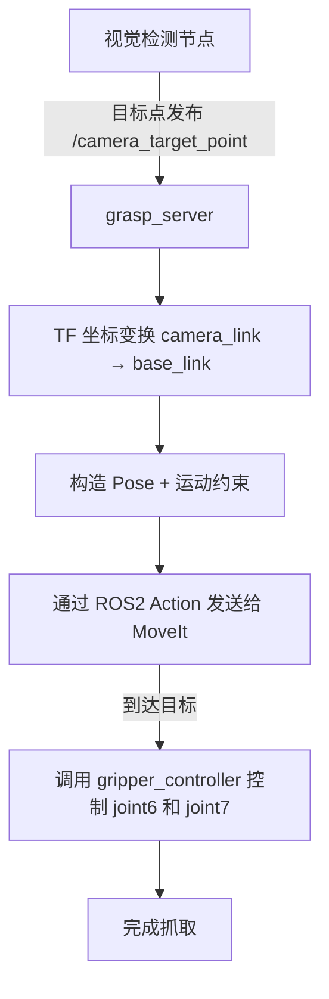

# 🦾 `pip_control` 模块说明文档

> **功能**：接收目标抓取点（通常由视觉系统提供），执行抓取动作（调用 MoveIt 进行运动规划 + 执行 + 控制夹爪），是机器人抓取任务的核心控制中心。

---

## 🧩 模块功能概览

- 接收来自视觉系统的抓取目标坐标（`geometry_msgs/PointStamped`）
- 将目标从 `camera_link` 坐标系变换到 `base_link`
- 构造抓取目标约束（位置 + 姿态）
- 通过 ROS 2 Action 发送给 MoveIt，控制机械臂移动至目标位置
- 抓取完成后，调用夹爪控制节点对 `joint6` 旋转、`joint7` 开合 （待完成）

---

## 🚀 工作流程图
初步的设想，姿态控制一直失败，还需要完善




---

## 📦 节点信息

### 节点名：
```bash
grasp_server
```

### 订阅话题：
- `/camera_target_point` (类型：`geometry_msgs/PointStamped`)
  - 来自视觉检测模块，表示目标物体在 `camera_link` 中的空间坐标

### 使用 Service：
- `grasp_command`（类型：`GraspCommand.srv`，你定义的抓取服务）
  - 启动一次抓取流程

### 使用 Action：
- `/move_action`（类型：`moveit_msgs/action/MoveGroup`）
  - 用于将抓取目标位姿发送给 MoveIt 执行抓取规划
---

## 🛠️ 前置依赖

确保以下依赖和配置已经准备好：

| 依赖/配置               | 说明                                                                 |
|------------------------|----------------------------------------------------------------------|
| ✅ 视觉检测节点         | 发布 `/camera_target_point`，目标点坐标应在 `camera_link` 下        |
| ✅ TF 坐标树           | `camera_link` → `base_link` 的静态 TF 变换需要用 `static_transform_publisher` 发布 |
| ✅ MoveIt 控制配置     | 已正确加载 URDF、SRDF，规划组名为 `"arm"`，末端执行器 link 为 `"link6"` |
| ✅ `/move_action`       | MoveIt 的 Action Server 已正常运行                                 |
| ✅ `gripper_controller` | 用于控制 `joint6`（夹爪方向） 和 `joint7`（夹爪宽度）               |
| ✅ 服务定义文件         | 自定义 Service `GraspCommand.srv` 已加入 `piper_msgs` 包并编译       |

---

## ⚙️ 启动与测试

### 启动 grasp_server：

```bash
source install/setup.bash
ros2 run piper_control grasp_server
```

### 模拟目标点输入（视觉替代）：

```bash
ros2 topic pub /camera_target_point geometry_msgs/PointStamped "{header: {frame_id: 'camera_link'}, point: {x: 0.4, y: 0.0, z: 0.2}}"
```

---

## 🧠 核心流程说明

### 1️⃣ 监听 `/camera_target_point`，转换为 `base_link` 坐标系

使用 `tf2_ros` 查询最新的坐标变换，将目标点实时转换到机械臂基坐标系下。

### 2️⃣ 构造抓取 `PoseStamped` 和 `Constraints`

- **位置约束**：将目标点设为一个小立方体区域
- **姿态约束**：保持夹爪水平，允许部分旋转自由度（可按任务调整）

### 3️⃣ 异步发送给 MoveIt 并监听反馈

- 创建 MoveIt Action 客户端
- 监听反馈 → 执行成功后进入下一阶段

### 4️⃣ 控制夹爪旋转与开合（调用 gripper_controller）

使用 ROS 2 Action 方式发送抓取角度 + 夹爪宽度。

---

## 🛑 常见问题与调试

| 问题                                                   | 解决方案                                                             |
|--------------------------------------------------------|----------------------------------------------------------------------|
| ⚠️ TF 转换失败：camera_link 不存在                    | 请确认发布了 camera → base_link 的 TF                              |
| ⚠️ MoveIt Action Server 无响应                         | 确保 `move_group` 节点正在运行                                     |
| ⚠️ Link `link6` 不在模型中                            | 检查 SRDF/URDF 中是否指定了末端执行器 link                          |
| ⚠️ 控制成功但机械臂不动                               | 检查发布的轨迹是否完整、目标位置是否过近或不可达                    |

---

## 🧪 示例测试命令

```bash
# 启动视觉相机 + TF
ros2 run tf2_ros static_transform_publisher 0.3 0.15 0.05 0 0 0 camera_link base_link

# 启动 grasp_server
ros2 run piper_control grasp_server

# 模拟目标点
ros2 topic pub /camera_target_point geometry_msgs/PointStamped "{header: {frame_id: 'camera_link'}, point: {x: 0.4, y: 0.1, z: 0.2}}"

# 最终确认执行动作，没有这个命令 机械臂是不会动的
ros2 service call /grasp_command std_srvs/srv/Trigger "{}"
```

---

## ✅ 下一步建议

- 集成视觉检测 → 自动发送目标点
- 加入抓取失败处理机制（如尝试多个姿态）
- 加入抓取后移动或放置模块
- 集成 TTS/语音指令系统，实现自然语言抓取

---

如果你需要我帮你自动生成对应的 launch 文件、节点间调用结构图，或者更完整的集成例子，也可以直接告诉我💡！
