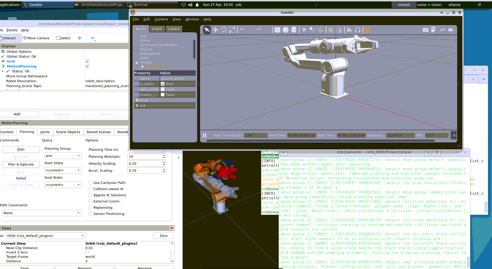

# 📖 README：Piper机械臂强化学习抓取部分

---

## 部分简介

本部分基于 ROS2 + Gazebo 仿真环境 + Moveit运动学控制，使用强化学习（PPO算法）训练 Piper 机械臂实现抓取任务。

- **目标**：控制机械臂末端移动至虚拟目标点附近，并成功夹取（模拟小球抓取）
- **仿真环境**：Gazebo
- **机器人控制**：ros2_control + MoveIt（部分辅助）
- **强化学习库**：Stable Baselines3（PPO）
- **训练接口**：自定义 Gym 风格环境 `MyRobotEnvV2`

---

## 系统结构

```bash
piper_rl/
├── piper_rl_node.py      # 包含MyRobotEnvV2环境定义
├── train.py              # 训练脚本（PPO算法）
├── ppo_models/               # 保存训练好的PPO模型
├── ppo_logs/                 # Tensorboard训练日志
```

---

## 环境说明 (随时迭代, update 2025-0427-18:27)

| 部分 | 内容 |
|------|------|
| 动作空间 | 末端 Δx, Δy, Δz 位移 + 夹爪开关，共4维 |
| 观测空间 | 6个关节角度 + 末端位置(x,y,z) + 目标点位置(x,y,z)，共12维 |
| 奖励函数 | 基于末端到目标的距离动态 shaping，成功抓取加大奖励 |
| 训练框架 | PPO，带大网络（256-256-128） |
| 控制发布 | JointTrajectory控制arm_controller与gripper_controller |

---

## 运行指南

### 1. 启动 Gazebo 仿真与 Moveit控制器

（确保 `robot_state_publisher` + `controller_manager` + `arm_controller` + `gripper_controller` 正常激活）

启动命令示例：

```bash
ros2 launch piper_gazebo piper_gazebo.launch.py
```

使用下面的指令查看当前仿真的控制器是否存在，我的这个有点问题（厂家的gazebo跟moveit有冲突，JRM,SDA,WY)
```bash
zzb@ubuntu:~/zzb_HDD/Project/piper$ ros2 control list_controllers
[INFO] [1745749774.518967135] [_ros2cli_110100]: waiting for service /controller_manager/list_controllers to become available...
arm_controller          joint_trajectory_controller/JointTrajectoryController  active      
gripper_controller      joint_trajectory_controller/JointTrajectoryController  active      
joint_state_broadcaster joint_state_broadcaster/JointStateBroadcaster          unconfigured
gripper8_controller     joint_trajectory_controller/JointTrajectoryController  unconfigured

```


然后启动
```
ros2 launch piper_moveit_config_v4 demo.launch.py
``` 
（后来发现不用moveit貌似还是照样跑仿真，很抽象, 这里面的控制器的关系已经不想去厘清了，毁灭吧）



此外，需要给机械臂设置一个目标点位让他去靠近：
```angular2
 ros2 topic pub -r 1 /base_target_point geometry_msgs/msg/PointStamped "{header: {stamp: {sec: 0, nanosec: 0}, frame_id: 'base_link'}, point: {x: 0.2, y: 0.24, z: 0.25}}"
```

### 2. 训练强化学习策略
自行更换路径
```bash
cd ~/your_project_parent_path/piper/
source install/setup.bash
python3 src/piper_rl/piper_rl/train.py
```

默认保存模型至 `ppo_models/`，日志保存在 `ppo_logs/`。

### 3. 测试训练好的模型

```bash
python3 src/piper_rl/piper_rl/train.py --test
```

机器人将按照训练得到的策略自动执行抓取任务。

---

## 训练可视化

可以通过 TensorBoard 查看训练曲线：

```bash
tensorboard --logdir=ppo_logs/
```
打开浏览器访问 `http://localhost:6006/`，观察 reward 曲线、loss变化等指标。

---

~后续为GPT 生成，勿cue~

---


## 当前存在问题

| 部分 | 描述 |
|------|------|
| 机械臂动作偶有抖动 | 动作空间设计已优化为末端控制，但仍受限于简单IK精度 |
| 夹爪控制粗糙 | 仅使用二值开合，未精准判定夹取成功 |
| 奖励稀疏问题缓解但未彻底消除 | 特别是在远距离目标点训练初期 |
| 目标点随机生成范围需进一步优化 | 避免生成机械臂难以到达的位置 |

---

# 🚀 后续改进方向（升级规划）

---

## 1. 动作控制层面

- 【重要】完善逆运动学（IK）求解过程，提高末端控制精度
- 引入动态规划（如DMP）生成平滑轨迹，而非单步增量

---

## 2. 状态空间优化

- 增加夹爪当前开合角度、夹持力度感知
- 添加目标物体特征编码（如大小、材质）

---

## 3. 奖励函数优化

- 采用分阶段奖励：接近 → 对准 → 夹持 → 抬升
- 引入视觉反馈辅助奖励（如检测夹取成功）

---

## 4. 策略优化

- 尝试 SAC（Soft Actor-Critic）算法，提升连续动作稳定性
- 多目标训练（Multi-goal RL），提升泛化能力

---

## 5. 工程结构

- 整理 launch 文件，标准化 Gazebo 启动 + 控制器加载
- 引入 rclpy参数服务器配置训练超参数（learning_rate, gamma等）

---

## 6. Sim-to-Real迁移

- 域随机化（Domain Randomization）：光照、摩擦、关节噪声
- 小范围真实机械臂fine-tune训练策略

---

# ✨ 小结

通过强化学习驱动 Piper 机械臂抓取小球是一个极具挑战性但又非常有意义的工作。本部分已建立了完整的训练、测试和评估体系，为后续扩展到更复杂任务（如多物体、多阶段操作）打下了坚实基础。

让我们继续探索，让机械臂学得更聪明，更自然！🤖🔥

